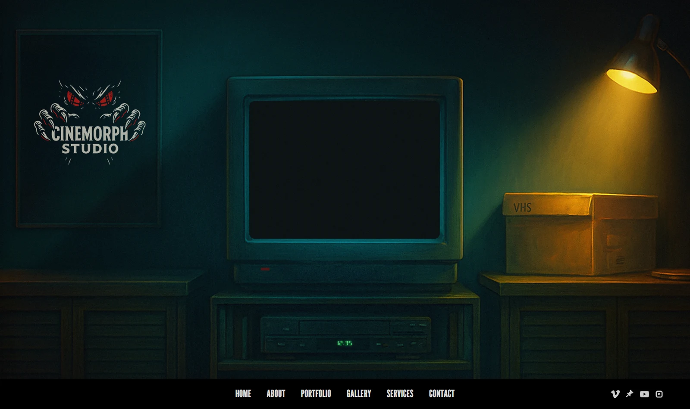
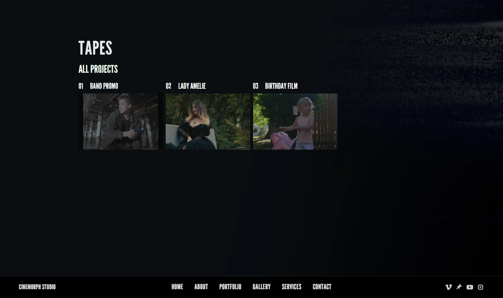
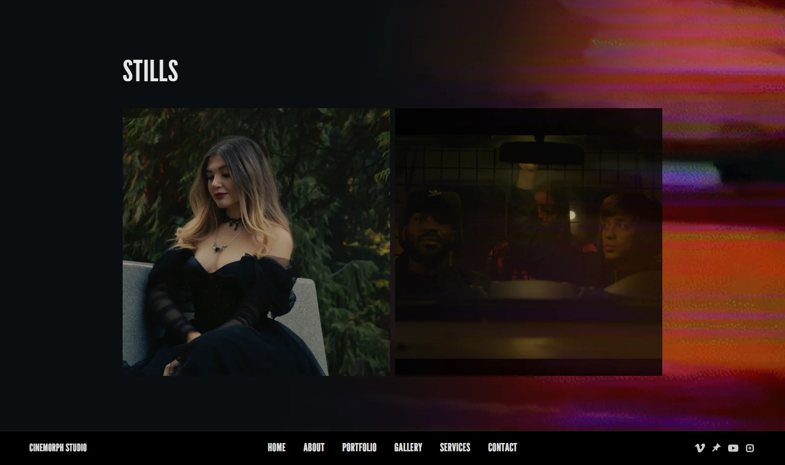
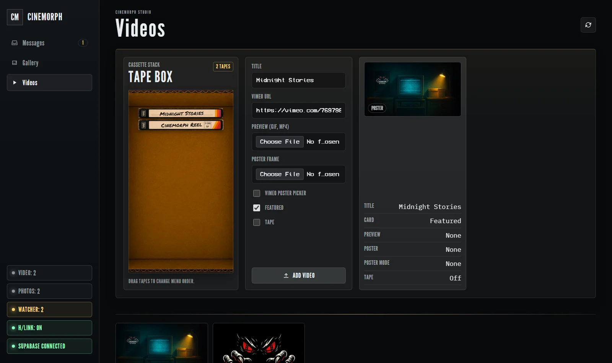
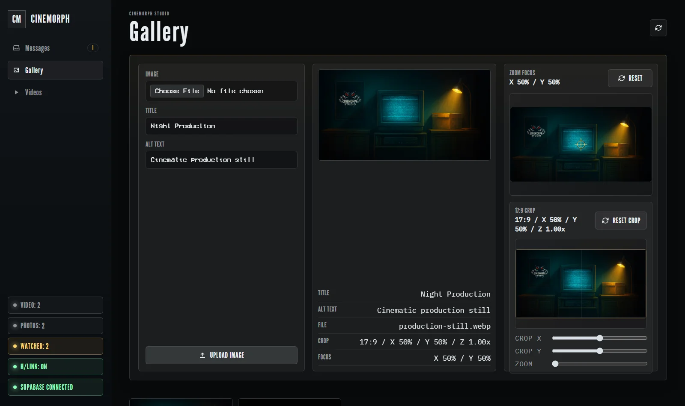

# CINEMORPH STUDIO

### An interactive cinematic portfolio built around television, VHS, and film

[Live Website](https://cinemorphstudio.com/) ·
[English](#english) ·
[Русский](#russian)

 

  

---

## English

### About the Project

Cinemorph Studio is a cinematic storytelling and production team based in
Vancouver, Washington. The website was designed as a complete visual experience
rather than a traditional grid-based portfolio.

Its identity combines analog television, VHS tapes, film equipment, atmospheric
light, and modern media delivery. Visitors can explore the studio, watch selected
projects, browse stills, learn about production services, and contact the team
through one connected experience.

### Public Experience

<table>
  <tr>
    <td width="50%">
      
    </td>
    <td width="50%">
      
    </td>
  </tr>
  <tr>
    <td align="center"><strong>Video Portfolio</strong></td>
    <td align="center"><strong>Stills Gallery</strong></td>
  </tr>
</table>

- Interactive television scene with working power, lighting, audio, and VCR states
- Dynamic VHS box with project cassettes generated from real portfolio data
- Drag-and-drop cassette insertion and Vimeo playback inside the television
- Supabase-powered portfolio with posters, motion previews, and featured projects
- Cinematic stills gallery with focal points and a full-screen viewer
- Mouse, touchpad, touch, and keyboard-friendly navigation
- Studio profile, team members, services, social channels, and contact details
- Contact form with reference links, server-side validation, and spam protection
- Responsive layouts and reduced-motion support

### Administration Dashboard

The project includes a protected content dashboard, allowing the studio to
update the website without editing source code.

<table>
  <tr>
    <td width="50%">
      
    </td>
    <td width="50%">
      
    </td>
  </tr>
  <tr>
    <td align="center"><strong>Video & VHS Management</strong></td>
    <td align="center"><strong>Gallery Crop & Focus Tools</strong></td>
  </tr>
</table>

> Administration screenshots use demonstration records. No private enquiries,
> credentials, or production customer data are included in this repository.

#### Messages

- Read, filter, archive, and delete website enquiries
- Track unread messages with live counters
- Detect and preview reference links included by clients

#### Gallery

- Upload images with titles and accessible alternative text
- Preview the public card before publishing
- Set image focal points and prepare the cinematic 17:9 crop
- Reorder entries with drag and drop
- Edit records and clean up replaced Storage files

#### Video and VHS

- Add and edit Vimeo projects
- Upload poster images and GIF or MP4 motion previews
- Generate a poster from a selected Vimeo frame
- Feature projects and preview the resulting public card
- Enable VHS presentation, edit cassette labels, and select tape textures
- Order portfolio cards and television cassettes independently

#### Portfolio Watcher

The built-in Portfolio Watcher highlights incomplete content such as missing
posters, previews, titles, alternative text, or VHS metadata before publication.

### Performance, Accessibility, and Security

- Modular browser-native JavaScript without a heavyweight frontend framework
- Lazy-loaded media and optimized Supabase image previews
- Responsive behavior tuned for desktop, mobile, mouse wheel, and touchpad
- Keyboard-accessible controls, dialogs, and gallery navigation
- Supabase authentication and Row Level Security compatible access
- Cloudflare Turnstile and server-side validation for public enquiries
- Authenticated server-side Vimeo poster generation

### Technology

`HTML5` · `CSS3` · `JavaScript` · `Supabase Auth` · `Supabase Database` ·
`Supabase Storage` · `Vimeo Player API` · `Cloudflare Turnstile` ·
`Netlify Functions` · `Node.js` · `FFmpeg`

  <a href="#cinemorph-studio">Back to top ↑</a>

---

## Русский

### О проекте

Cinemorph Studio — команда кинематографического продакшена и визуального
сторителлинга из Ванкувера, штат Вашингтон. Сайт задуман не как обычная сетка
портфолио, а как самостоятельный интерактивный опыт.

Визуальная концепция объединяет аналоговое телевидение, VHS-кассеты, съёмочную
технику, атмосферный свет и современную систему публикации контента. Посетители
могут познакомиться со студией, посмотреть проекты, открыть галерею, изучить
услуги и связаться с командой в рамках одного цельного интерфейса.

### Публичная часть

<table>
  <tr>
    <td width="50%">
      
    </td>
    <td width="50%">
      
    </td>
  </tr>
  <tr>
    <td align="center"><strong>Видеопортфолио</strong></td>
    <td align="center"><strong>Галерея фотографий</strong></td>
  </tr>
</table>

- Интерактивная TV-сцена с питанием, освещением, звуком и состояниями видеомагнитофона
- Динамический VHS-бокс с кассетами, созданными из реальных данных портфолио
- Перетаскивание кассеты в видеомагнитофон и воспроизведение Vimeo внутри телевизора
- Портфолио на Supabase с постерами, анимированными превью и избранными проектами
- Кинематографическая галерея с фокусными точками и полноэкранным просмотром
- Навигация, адаптированная под мышь, тачпад, сенсорный экран и клавиатуру
- Информация о студии, команда, услуги, социальные сети и контакты
- Контактная форма с референсами, серверной проверкой и защитой от спама
- Адаптивная вёрстка и поддержка режима уменьшенной анимации

### Административная панель

Проект включает защищённую панель управления, через которую команда может
обновлять сайт без редактирования исходного кода.

<table>
  <tr>
    <td width="50%">
      
    </td>
    <td width="50%">
      
    </td>
  </tr>
  <tr>
    <td align="center"><strong>Управление видео и VHS</strong></td>
    <td align="center"><strong>Кадрирование и фокус галереи</strong></td>
  </tr>
</table>

> Для скриншотов админки использованы демонстрационные записи. Репозиторий не
> содержит личные обращения клиентов, учётные данные или закрытую информацию.

#### Сообщения

- Просмотр, фильтрация, архивация и удаление обращений с сайта
- Счётчик непрочитанных сообщений
- Распознавание и предпросмотр ссылок-референсов от клиентов

#### Галерея

- Загрузка фотографий с названием и доступным альтернативным текстом
- Предпросмотр итоговой карточки до публикации
- Настройка фокусной точки и подготовка кинематографического кадра 17:9
- Изменение порядка элементов перетаскиванием
- Редактирование записей и очистка заменённых файлов в Storage

#### Видео и VHS

- Добавление и редактирование Vimeo-проектов
- Загрузка постеров и анимированных GIF- или MP4-превью
- Создание постера из выбранного кадра Vimeo
- Выделение избранных проектов и предпросмотр публичной карточки
- Включение VHS-режима, настройка надписи и выбор текстуры кассеты
- Независимая сортировка карточек портфолио и кассет в телевизоре

#### Portfolio Watcher

Встроенный Portfolio Watcher заранее показывает незаполненные данные: постеры,
превью, названия, альтернативный текст или VHS-метаданные.

### Производительность, доступность и безопасность

- Модульный JavaScript без тяжёлого frontend-фреймворка
- Ленивая загрузка медиа и оптимизированные превью Supabase
- Адаптация под компьютер, телефон, колесо мыши и жесты тачпада
- Управление с клавиатуры, доступные модальные окна и навигация по галерее
- Авторизация Supabase и совместимость с Row Level Security
- Cloudflare Turnstile и серверная проверка контактной формы
- Серверное создание Vimeo-постеров только для авторизованных администраторов

### Технологии

`HTML5` · `CSS3` · `JavaScript` · `Supabase Auth` · `Supabase Database` ·
`Supabase Storage` · `Vimeo Player API` · `Cloudflare Turnstile` ·
`Netlify Functions` · `Node.js` · `FFmpeg`

  <a href="#cinemorph-studio">Наверх ↑</a>

